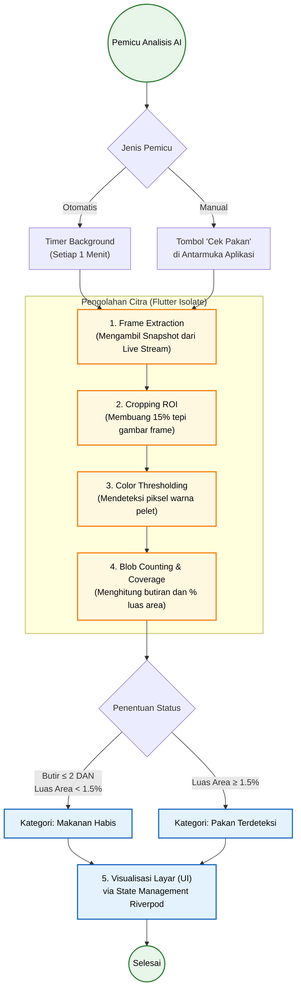

# Gambar Diagram Alur Kerja (Workflow) Sistem AI Deteksi Pakan

Sesuai dengan Bagian 4 di file `PENJELASAN_PROYEK.md`, berikut adalah diagram alir (*Flowchart*) yang memvisualisasikan bagaimana AI bekerja dari awal (Pemicu) hingga akhir (Tampil di Layar).

## Kode Mermaid Diagram

## Penjelasan Singkat (Bisa dilampirkan di bawah gambar)
Diagram ini menjelaskan alur deteksi citra (Computer Vision) yang sepenuhnya dieksekusi secara mandiri oleh aplikasi *mobile*. AI dapat dipicu secara otomatis setiap 1 menit atau secara manual lewat tombol. Untuk mencegah aplikasi menjadi lambat (lag/freeze), seluruh proses berat (seperti *Frame Extraction*, pemotongan area *ROI*, filter warna RGB, dan *Blob Counting*) dialihkan ke dalam **Flutter Isolate** (*thread* CPU sekunder pada HP). Hasil kalkulasi dari *Isolate* (apakah makanan habis atau masih sisa) kemudian dikembalikan ke layar utama dan diperbarui ke pengguna menggunakan *Riverpod State Management*.
