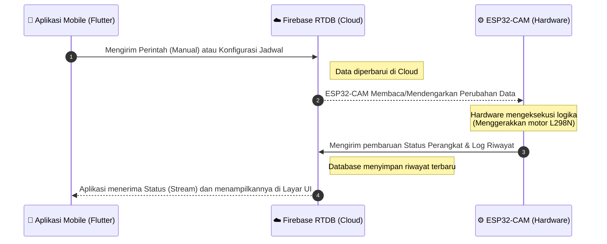

# Gambar 3.7 Alur Komunikasi Data Real-Time

Diagram ini dirancang khusus untuk menggambarkan 4 poin urutan komunikasi bolak-balik antara Aplikasi, Firebase, dan ESP32-CAM persis seperti instruksi yang Anda berikan. 

Karena ini adalah "Alur Komunikasi", diagram yang paling tepat secara akademis adalah **Sequence Diagram** (Diagram Sekuensial).

## Kode Mermaid Diagram

## Penjelasan Alur Komunikasi (Untuk Laporan Bab 3)

Alur komunikasi data pada sistem AquaFeed berjalan secara dua arah (*bidirectional*) secara *real-time* dengan mengandalkan Firebase Realtime Database sebagai perantara utama (Server). Berikut adalah tahapan komunikasi yang terjadi (seperti pada Gambar 3.7):

1. **Aplikasi ke Firebase**: Pengguna menggunakan antarmuka aplikasi (*mobile app*) untuk mengirimkan perintah langsung (buka/tutup manual) atau merubah susunan jam pada penjadwalan otomatis. Aplikasi akan mengunggah (push) data tersebut ke *node* yang bersesuaian di Firebase.
2. **Firebase ke ESP32-CAM**: Mikrokontroler ESP32-CAM yang selalu terhubung ke internet dan mendengarkan (*listen*) perubahan pada Firebase (*stream*), akan segera mengunduh/membaca data perintah atau jadwal terbaru tersebut secara *real-time*.
3. **ESP32-CAM ke Firebase**: Setelah ESP32-CAM berhasil menjalankan instruksi fisik (memutar motor DC menggunakan modul L298N untuk menjatuhkan pakan), ia akan mengirimkan (post) laporan umpan balik ke Firebase, berupa penambahan data riwayat aktivitas (*Log*) serta status alat terkini (*device_status = Online*).
4. **Firebase ke Aplikasi**: Perubahan status dan tambahan riwayat dari perangkat keras yang baru saja masuk ke Firebase, akan langsung dipancarkan kembali ke aplikasi *mobile*. Aplikasi akan membaca perubahan state tersebut dan me-render ulang antarmuka layar (UI) agar pengguna dapat melihat indikator status secara aktual tanpa perlu melakukan *refresh*.
