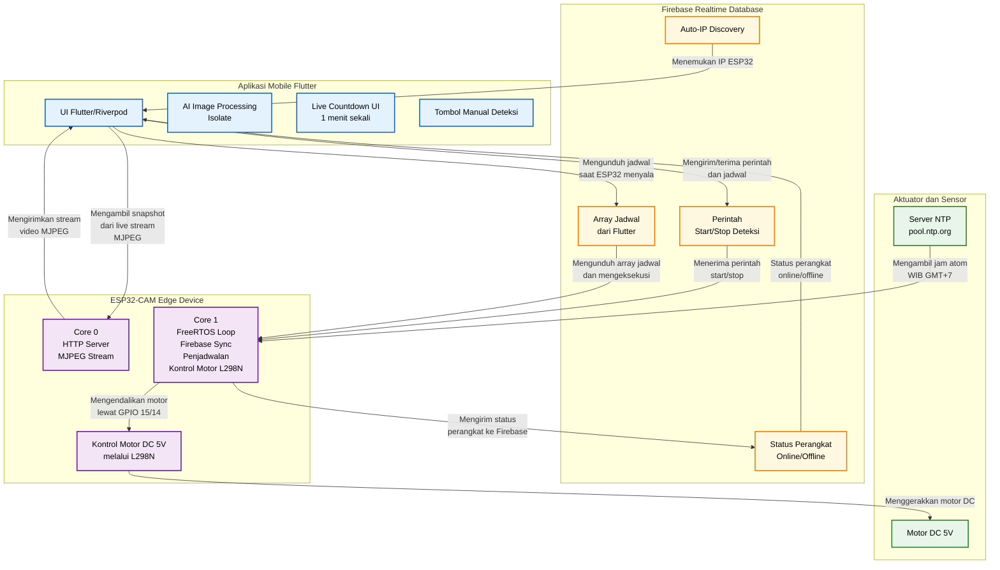

# Gambar 3.1 Arsitektur Sistem IoT Pemberi Pakan Ikan (AquaFeed)

Berikut adalah diagram blok Arsitektur Sistem untuk laporan Anda. Anda bisa merendernya menjadi gambar resolusi tinggi menggunakan [Mermaid Live Editor](https://mermaid.live/).

## Kode Mermaid Diagram

## Penjelasan Arsitektur Sistem (Untuk Teks Laporan)

Arsitektur sistem IoT cerdas *AquaFeed* terdiri dari tiga bagian utama, yaitu perangkat keras (*Hardware/Node*), peladen *cloud* (*Backend*), dan aplikasi seluler (*Frontend*). Alur komunikasi dan pengolahan data pada sistem ini berjalan sebagai berikut:

1. **Aplikasi Mobile (Flutter)**: Bertindak sebagai pusat kendali bagi pengguna. Pengguna dapat memberikan perintah (misalnya menekan tombol "Beri Pakan") atau mengatur jadwal otomatis. Aplikasi ini terhubung langsung ke **Firebase Realtime Database** untuk menulis perintah (operasi *Write*) dan membaca status terbaru dari alat (operasi *Read*).
2. **Firebase Realtime Database (Cloud)**: Berfungsi sebagai *broker* atau penyedia *database* JSON waktu-nyata (*real-time*). Firebase bertugas menyinkronkan setiap perubahan data antara aplikasi *mobile* dan mikrokontroler. Misalnya, jika aplikasi mengubah status *feed_now* menjadi `true`, Firebase akan langsung meneruskannya ke ESP32.
3. **Router / Jaringan WiFi**: Perantara konektivitas internet agar Aplikasi dan ESP32-CAM dapat saling terhubung. Khusus untuk *streaming* video dari kamera, koneksi tidak melalui Firebase, melainkan aplikasi *mobile* akan mengakses *IP Address* ESP32 (melalui peladen HTTP internal ESP32) untuk menarik data video (*MJPEG stream*) secara langsung.
4. **Mikrokontroler (ESP32-CAM)**: Bertindak sebagai otak di sisi perangkat keras. ESP32 secara terus-menerus memantau *Firebase* untuk mendapatkan jadwal terbaru dan mengeksekusi perintah.
5. **Sensor dan Aktuator**: 
   - **Kamera OV2640**: Mengambil data visual dari lingkungan kolam/akuarium dan menyajikannya dalam bentuk peladen *web* gambar berjalan (HTTP *Stream*). Gambar ini juga ditarik oleh aplikasi *mobile* untuk diolah menggunakan AI (*Computer Vision*) guna mendeteksi sisa pakan tanpa memerlukan sensor berat fisik.
   - **Motor Servo**: Bertindak sebagai aktuator fisik (*output*). Saat perintah pakan diterima (baik manual dari Firebase maupun otomatis berdasarkan jam internal NTP), ESP32 akan mengirimkan sinyal PWM ke Motor Servo untuk membuka katup penampung pakan, lalu menutupnya kembali.
