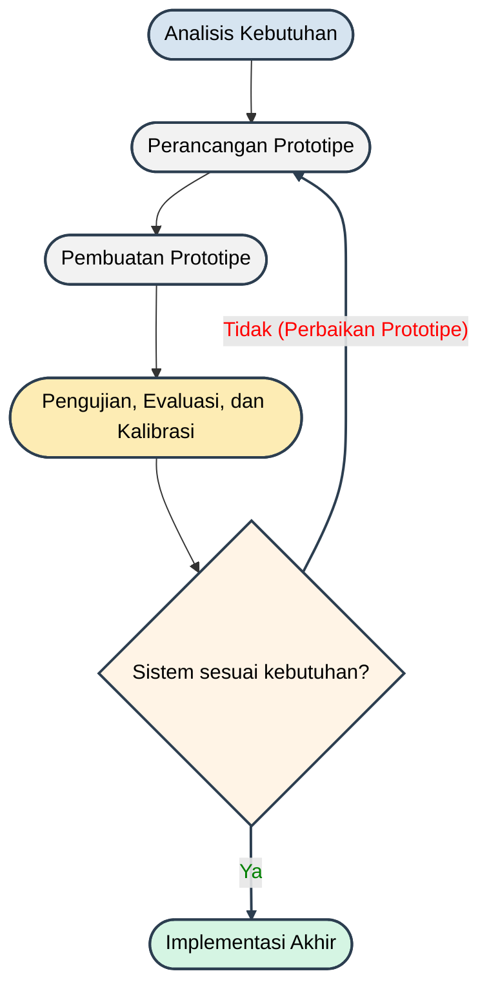

# Diagram Alur Penelitian (Metode Prototyping)

Berikut adalah diagram alur untuk sistem/proyek Tugas Akhir Anda (AquaFeed) yang disesuaikan dengan gambar referensi yang Anda berikan. Diagram ini menggunakan format **Mermaid**. Anda bisa menggunakan *tools* seperti [Mermaid Live Editor](https://mermaid.live/) untuk mengubah kode di bawah ini menjadi gambar beresolusi tinggi (PNG/JPG) yang siap dimasukkan ke Microsoft Word.

## Kode Mermaid Diagram

## Penjelasan Alur (Untuk Ditulis di Bab 3 / Laporan Tugas Akhir)

Metode penelitian dan pengembangan sistem pintar *AquaFeed* ini menggunakan pendekatan **Prototyping** dengan tahapan sebagai berikut:

1. **Analisis Kebutuhan**: Tahap awal untuk mengumpulkan data dan menentukan kebutuhan spesifikasi perangkat keras (*hardware*) seperti ESP32-CAM dan Motor Servo, serta perangkat lunak (*software*) berupa aplikasi Flutter (dengan algoritma AI Computer Vision) dan Firebase.
2. **Perancangan Prototipe**: Merancang skema elektronik (Wiring), mekanik (desain 3D wadah pakan), dan antarmuka (UI/UX) aplikasi mobile *AquaFeed*.
3. **Pembuatan Prototipe**: Merakit komponen elektronik ke mikrokontroler ESP32, membuat wadah pakan, serta menulis kode program (*coding*) untuk *firmware* dan aplikasi *mobile*.
4. **Pengujian, Evaluasi, dan Kalibrasi**: Menguji fungsi keseluruhan (*black box testing*), menguji tingkat keakuratan deteksi AI *Computer Vision* dalam mengenali sisa pakan, serta mengevaluasi jeda/kecepatan transmisi video dari kamera ESP32-CAM ke aplikasi.
5. **Sistem Sesuai Kebutuhan? (Keputusan)**: 
   - Jika sistem **belum** sesuai (masih terdapat *error* atau algoritma AI tidak akurat mendeteksi warna pakan), maka akan dilakukan **Perbaikan Prototipe** dengan mengulang tahap perancangan atau perbaikan kode.
   - Jika sistem **sudah (Ya)** berjalan sesuai spesifikasi dan fungsi yang diharapkan, maka prototipe akan masuk ke tahap **Implementasi Akhir**.
6. **Implementasi Akhir**: Alat *AquaFeed* dipasang dan diimplementasikan secara nyata pada kolam atau akuarium yang sesungguhnya.
