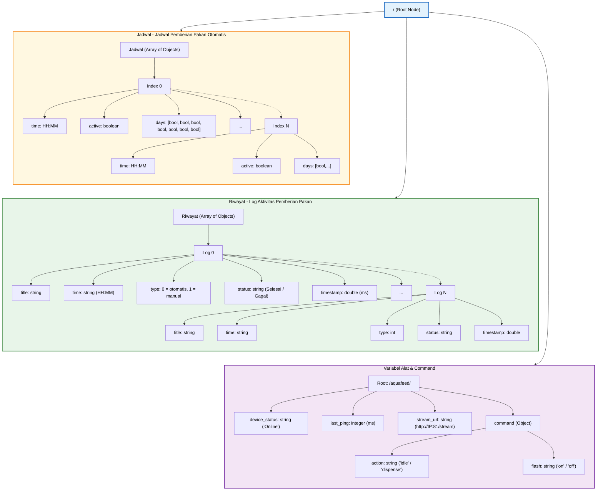

# Gambar Struktur Firebase Realtime Database

Berikut adalah diagram pohon yang menggambarkan struktur JSON dari Firebase Realtime Database yang digunakan pada proyek AquaFeed. Anda dapat membukanya di Mermaid Live Editor untuk melihat visualisasinya.

## Kode Mermaid

