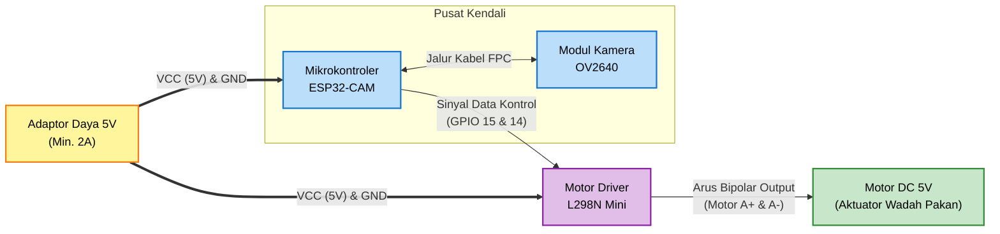

# Gambar 3.2 Diagram Blok Perangkat Keras Sistem

Berikut adalah rancangan diagram blok khusus untuk Perangkat Keras (*Hardware*) dari sistem AquaFeed. Anda dapat menyalin kode ini ke Mermaid Live Editor untuk menjadikannya gambar visual.

## Kode Mermaid Diagram

## Penjelasan Diagram Blok Perangkat Keras (Untuk Teks Laporan)

Diagram blok perangkat keras (Gambar 3.2) mengilustrasikan bagaimana setiap komponen elektronik saling terhubung, baik melalui jalur kelistrikan (catu daya) maupun jalur sinyal data kendali. Berikut adalah penjelasan untuk setiap bagian:

1. **Adaptor Daya 5V**: Berfungsi sebagai sumber energi listrik (*Power Supply*) utama untuk seluruh sistem. Mengingat beban kerja kamera dan motor yang cukup berat, digunakan arus minimal 2 Ampere.
2. **Mikrokontroler ESP32-CAM**: Bertindak sebagai otak sentral sistem yang memproses penjadwalan, sinkronisasi *cloud*, dan logika aktuator.
3. **Modul Kamera OV2640**: Kamera terintegrasi yang terhubung ke modul utama menggunakan kabel fleksibel (FPC) untuk menangkap keadaan sisa pakan di wadah.
4. **Motor Driver L298N Mini**: Rangkaian H-Bridge yang berfungsi sebagai saklar dan jembatan arus. Mikrokontroler tidak mampu menyuplai arus besar secara langsung ke motor, sehingga diperlukan IC Driver ini. Ia menerima sinyal kontrol arus lemah (3.3V) dari GPIO 14/15 ESP32, lalu mengalirkan arus listrik kuat dari Adaptor untuk menggerakkan motor.
5. **Motor DC 5V**: Aktuator fisik (*output* akhir) yang berfungsi secara mekanik untuk membuka dan menutup katup wadah pakan sesuai arahan dari motor *driver*.
